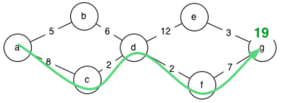

# Graph Traversal

## Objectives
- Learn about graph data structures
- Explore [recursive functions](https://www.geeksforgeeks.org/depth-first-search-or-dfs-for-a-graph/)
- Learn how to traverse a data tree [depth-first](https://en.wikipedia.org/wiki/Depth-first_search)

## Overview
In this excercise, our goal is to determine the shortest distance between two cities.  This is a recursive routing algorithm project based on a CS210 class at University of Oregon, by [Michal Young.](https://classes.cs.uoregon.edu/15W/cis210/assignments/Assnmt5-Routing.php)  This project involves recursion, and you mainly have to carefully design and implement just one recursive function.

## Instructions
In the mythical Kingdom of Boringham, the cities are named a,b,c,d,e,f, and g, with road distances in furlongs as follows:  


Your program must determine the shortest possible distance between two cities. For example, if it is asked the difference between a and g on the given map, it should determine that the shortest route is 19 furlongs:  


Here is a sample route description.  It corresponds to the route shown on the map above:  
```
# This sample map data corresponds to the diagram above
a, b, 5
a, c, 8
b, d, 6
c, d, 2
d, e, 12
d, f, 2
e, g, 3
f, g, 7
```
The input and output in the command or terminal window will look like this:

```console
$ python3 routes.py a g sample-map.txt
Distance from a to g is 19.0
```
In case of a misspelled city, your program will report that it does not appear on the map:

```console
$ python3 routes.py a x sample-map.txt
Destination  x  is not on the map
```
It can also cope with cities that are present on the map, but with no route between:
```console
$ python3 routes.py a x sample-map-noreach.txt
You can't get from a to x
```

## A strategy
There are several possible algorithms one could apply to this problem.   A simple depth-first search using a “single source shortest path” approach would be a good place to start. This approach finds the shortest distance from a single source (the starting city) to all other reachable cities using depth-first search.  
Here is a step-by-step example for finding the distance from city `a` to city `g`:

- Notice that the distance from city 'a' to city 'a' is zero furlongs.
- Calculate the distances of the neighbors of 'a'.
- From each city, make _recursive_ calls to calculate the distance of it's neighboring cities. Suppose the recursive call on city 'b' occurs next, In this case, calculate a distance of 5 + 6 = 11 for city 'd'.
- Later, a recursive call from city 'c' will find a shorter distance to 'd'.
- When you find a shorter route to a city that has already been visited, the new shorter distance becomes the new estimate. Since this could improve estimates of distance for other cities reachable from the current city (e.g., any estimates of distancs to e, f, and g that we have made using the estimate of 11 furlongs to city d), we must again make the recursive calls from the city with the improved estimate.  Using the improved estimate of 10 furlongs from a to d, we obtain distances to e and f.
- Again there two ways to reach city g. Suppose this time, just by luck, we first explore the path going through f, and obtain an estimate of 19 for g.
- Later we explore the road from e to g. However, it produces a worse estimate, 25 furlongs, so we keep the old estimate of 19 and do not repeat exploration from city g.

This algorithm is not guaranteed to be fast (in the worst case we could make four different estimates of the distance to city g, and with a more complicated road map we might explore every city many times). There are Better algorithms that propagate distance estimates in a similar way but may visit cities in an order that differs from depth-first search.

## Where to start?
Expressing the above strategy in Python code depends a lot on how the road map and the current estimates of distance are represented. The starter code represents the road map in a variable roads as a dictionary. The sample map above would be represented this way:

```python
{
   'a': [('b', 5.0), ('c', 8.0)],
   'c': [('a', 8.0), ('d', 2.0)],
   'b': [('a', 5.0), ('d', 6.0)],
   'e': [('d', 12.0), ('g', 3.0)],
   'd': [('b', 6.0), ('c', 2.0), ('e', 12.0), ('f', 2.0)],
   'g': [('e', 3.0), ('f', 7.0)],
   'f': [('d', 2.0), ('g', 7.0)]
}
```
Consider for example if we inquire about roads from city a, that is `roads["a"]`. We would obtain a list of connections and distances in this form:

```python
[('b', 5.0), ('c', 8.0)]
```
The first element of this list is a tuple `('b', 5.0)`. A tuple can be “deconstructed” (that is, separated into its components) with a Python assignment statement to multiple variables. For example, if we write
```python
to_city, dist = ('b', 5.0)
```
the value 'b' will be stored in `to_city` and the value 5.0 will be stored in `dist`. This is called "unpacking".

Note that each road is represented twice. For example, the road between a and b is represented as a road from a to b and as a road from b to a, both with the same distance 5.0.

In addition to the road map, your program will need to keep its current estimates of distance to each city. This can easily be done using a Python dictionary structure, with city names as keys and estimated distances as values. In the starter code, the variable distances are used to store these estimates. Note that if a city has not yet been visited, it will not appear in the distances dict. If it is still not in the distances dict after exploring all cities reachable from the start city, there must not be any path from the start city to the destination.

There is a lot of starter code supplied with this project, so you can concentrate on the function `dfs`. The starter code for that function finds the distance of some route from the beginning city to the ending city, but _not necessarily the best route_. You must rewrite it to find the best route.

## Data sets
In addition to the starter code, there are some road maps. 
- `ME-distances.txt` is taken from a set of distance estimates found online. Distances in `ME-distances.txt` are in hours on horseback, rather than furlongs, but that doesn't matter. ME stands for Middle Earth, if you are LOTR fan.
- `sample-map.txt` is the map used as an example above; 
- `sample-map-noreach.txt` is a variation that adds a pair of cities x and y that are not reachable from anywhere else.
- `skip-map.txt` is a map in which the shortest paths are not the most direct paths. This may be useful in testing your program to make sure it is finding the shortest distance rather than finding the route with the smallest number of steps.

## Efficiency
In computer science and software development, we usually characterize the efficiency of an algorithm or program as a function of problem size, reasoning about the worst possible case. If you consider the depth first search in this regard, it is easy to construct a worst case that, for n cities and 2n roads, explores 2^n paths before it finally finds the shortest path. (Convince yourself by constructing a map with 5 cities that could take up to 32 steps.) We say that the algorithm is _exponential_ in the number of cities. That's bad.

There are much, much better algorithms, but they are a little more complicated. If you have finished implementing the simple depth-first search, and would like to try implementing one of the more efficient algorithms, let your instructor know and we can provide some guidance on implementing a better search algorithm.

*Aside*: Furlongs are an ancient measure of distance, used originally by the Roman Empire and based on how long a person could walk in an hour. In most of the world they have long ago been replaced by SI measures. In the U.S. they are still a legal measure, although the length of a furlong varies slightly from state to state. This is a crazy way to measure anything, but not much crazier than feet, inches, ounces, and miles.

## Testing your algorithm
Thanks to Kenzie SE3 student James Horton, there is now a test suite to apply to your routing algorithm. The test fixture (unittest class) is located in the `tests` folder and is discoverable by `unittest`, `pytest`, or `nose`.  Your algorithm will be tested against all of the input data sets. To run all of the tests, use the following command for example:
```console
$ python -m unittest discover tests
```
To run just a single test from the TestRoutes suite, use a command like this:
```console
$ python -m unittest tests.test_routes.TestRoutes.test_dfs_sample_map
```

You can also run and debug these same tests using the `Test Explorer` extension built in to the VSCode editor, by enabling automatic test discovery.  This is a really useful tool and we highly recommend to learn it.

https://code.visualstudio.com/docs/python/testing#_test-discovery

- Test framework is `unittest`
- Test folder pattern is `tests`
- Test name pattern is `test*`

## Submitting your work
To submit your solution for grading, you will need to create a github [Pull Request (PR)](https://docs.github.com/en/github/collaborating-with-issues-and-pull-requests/about-pull-requests).  Refer to the `PR Workflow` article in your course content for details.  If you are accessing this assignment from within Github Classroom, the PR should be created for you automatically.

# References
- [Univ Oregon CIS 210, Michal Young](https://classes.cs.uoregon.edu/15W/cis210/assignments/Assnmt5-Routing.php)
- [Cornell CS2112 Lecture 24](https://www.cs.cornell.edu/courses/cs2112/2012sp/lectures/lec24/lec24-12sp.html)
- <a href="https://www.youtube.com/watch?v=gXgEDyodOJU"> </a>
